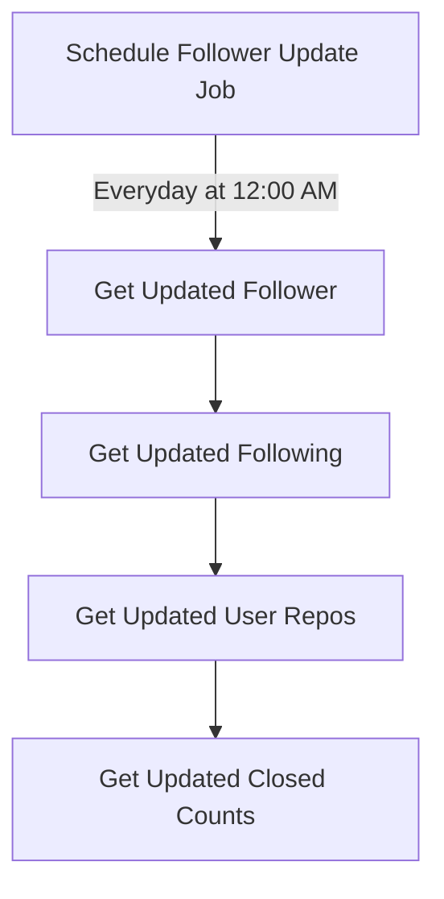

## Introduction

## About

- A `scheduled cron job` has been implemented to perform the task of `fetching the user's GitHub profile data` every day at `12:00 AM`. This ensures that the data is `updated consistently`, providing the most recent information whenever a user interacts with our analysis endpoints.

## Flow



## Scheduler Folder Structure

```bash title="Controller"
VersionManager/
|-- Scheduler/
|   | -- /profile.scheduler.js
```

:::info

- To ensure the proper functioning of `schedulers` and `data retrieval` from the user's GitHub profile, I've created `several helper functions` designed to fetch data such as `followers, following, new repositories`, etc. These functions are `called within our scheduler jobs` to keep the `data up-to-date`.
  :::
