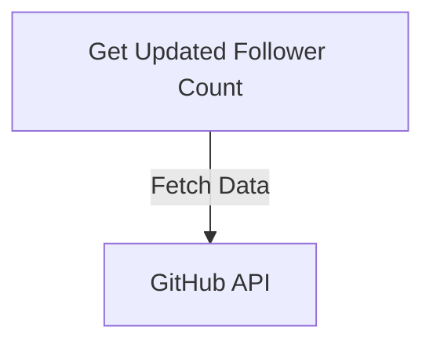
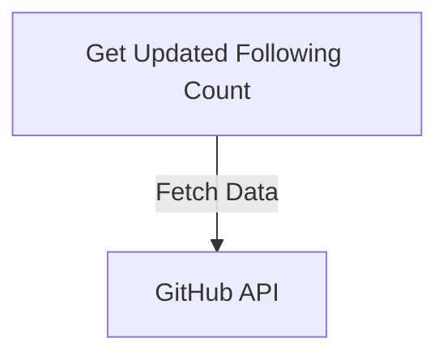
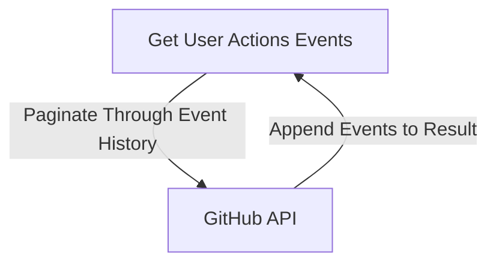

# Profile Service

## `getUpdatedFollowerCount Controller`

### Description

This controller fetches the count of followers for a specified GitHub user. It queries the GitHub API to retrieve the follower count.

### Flow Diagram

## `getUpdatedFollowingCount Controller`

### Description

This controller fetches the count of users that a specified GitHub user is following. It queries the GitHub API to retrieve the following count.

### Flow Diagram

## `getUserActionsEvents Controller`

### Description

This controller fetches the events associated with a specified GitHub user's profile. It retrieves events such as push, pull, watch, etc., by paginating through the user's event history.

### Flow Diagram

---

:::info

- These controllers interact with the GitHub API to provide real-time information about a user's profile, including follower count, following count, and a comprehensive list of events associated with the user's actions on GitHub.
  :::
