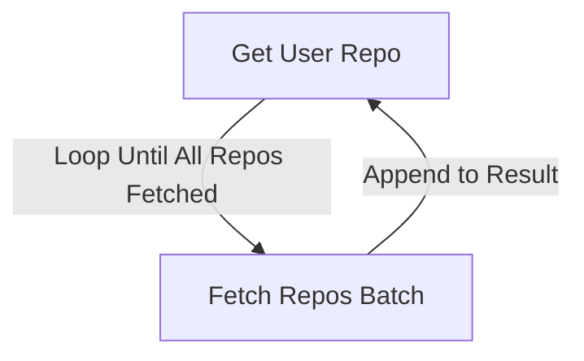
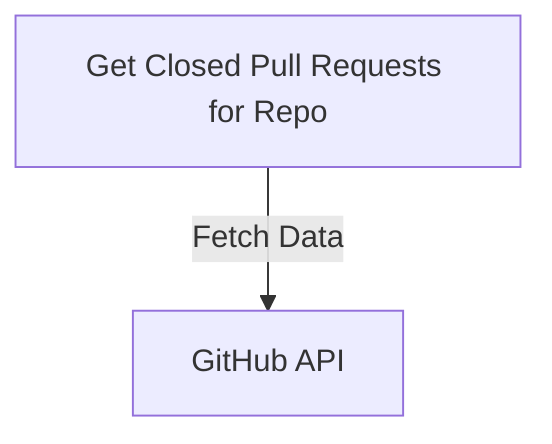
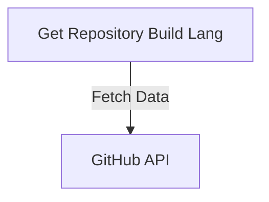
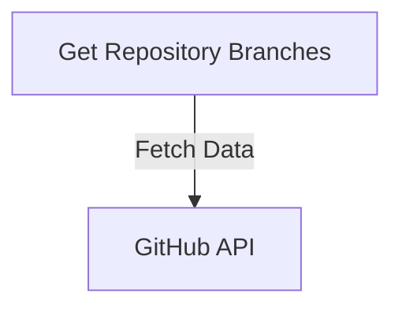
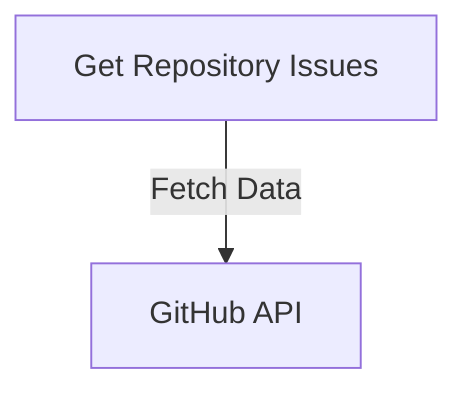
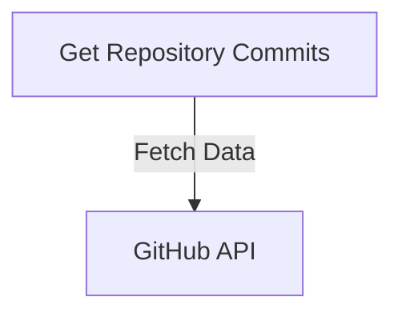

# Repository Service

## `getUserRepo Controller`

### Description

This controller fetches all repositories owned by a specified GitHub user. It utilizes the GitHub API to retrieve repositories in batches of 100 per page until all repositories are fetched.

### Flow Diagram

## `getListOfClosedPullRequestforRepo Controller`

### Description

This controller fetches a list of closed pull requests for a specific repository owned by a GitHub user. It queries the GitHub API to obtain the closed pull requests.

### Flow Diagram

## `getRepositoryBuildLang Controller`

### Description

This controller fetches the programming languages used in a specified repository. It queries the GitHub API to retrieve the languages.

### Flow Diagram

## `getRepositoryBranches Controller`

### Description

This controller fetches the branches of a specified repository. It queries the GitHub API to obtain the list of branches.

### Flow Diagram

## `getRepostoryIssues Controller`

### Description

This controller fetches issues for a specific repository based on the provided state (open or closed). It queries the GitHub API to retrieve the issues.

### Flow Diagram

## `getRepositoryCommits Controller`

### Description

This controller fetches the commits for a specified repository. It queries the GitHub API to obtain the commit history.

### Flow Diagram

---

:::info

- These controllers are designed to interact with the GitHub API to provide valuable insights into a user's repositories, such as repository details, closed pull requests, programming languages used, branches, issues, and commit history.
- They would be used in the [Custom-Github-Endpoints](/docs/how-to-guide/Github-Endpoints/intro.md) for analysing the response and saving the useful response in the database.
  :::
