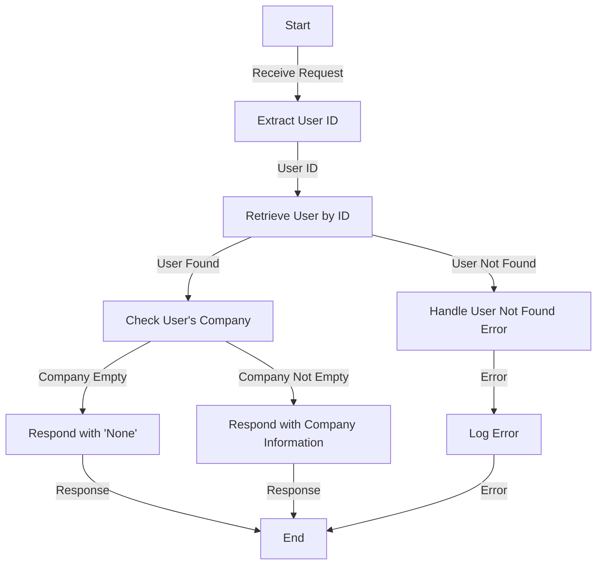

# Get Organistaion Analysis

## About

- The `getOrganisationAnalysis` function is a server-side endpoint that provides analysis on the organization affiliation of a specific user. Upon receiving a request, the function extracts the user ID, retrieves user information from the database, and checks if the user exists. If the user exists, it further examines the user's company affiliation. If the company information is empty, indicating that the user does not have a specified organization, the function responds with a JSON object stating "None." Otherwise, it responds with a JSON object containing the user's company information.

- The function incorporates robust error handling by throwing a custom error class (`UserNotFoundError`) in case the user is not found in the database. It responds with the appropriate status codes and error details in JSON format for both successful and error scenarios.

- This functionality provides a quick analysis of a user's organizational affiliation, contributing to a comprehensive profile overview.

## Flow



## Endpoint

```javascript title="Routes/Analysis/profileAnalysis.router.js"
ProfileAnalysisRouter.get(
  "/user/profileAnalysis/getCompanyNameAnalysis",
  getOrganisationAnalysis
);
```
