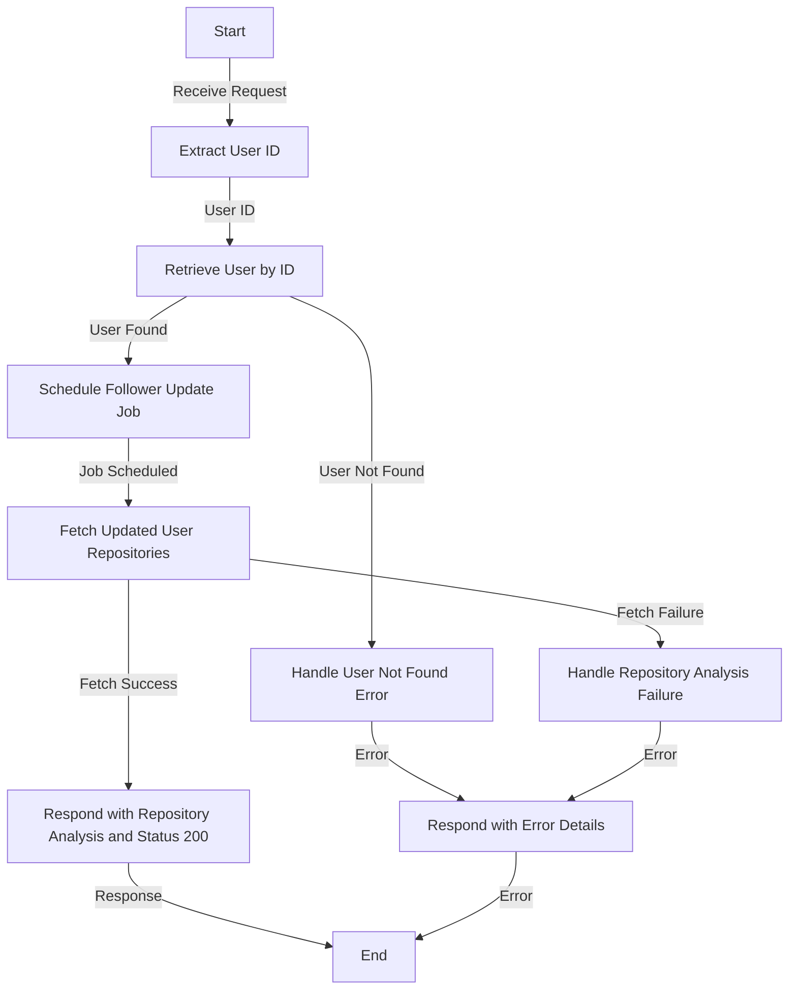

# Get Public and Private Repo Count Analysis

## About

- The `getNumberOfPublicAndPrivateRepoAnalysis` function is a crucial component in the server application, tasked with analyzing the number of public and private repositories for a specified user. Upon receiving a request, the function extracts the user ID, retrieves user information from the database, and schedules periodic follower updates using `scheduleFollowerUpdateJob`. Subsequently, it asynchronously fetches the updated user repositories with `getUpdatedUserRepos`. If successful, it responds with a JSON object containing the repository analysis and a 200 status code. In the event of errors, such as the user not existing or issues during the analysis, it gracefully handles errors and responds with appropriate status codes and error details in JSON format. This function provides valuable insights into a user's repository landscape, enhancing the server's capability to analyze and respond to repository-related requests.

## Flow



## Endpoint

```javascript title="Routes/Analysis/profileAnalysis.router.js"
ProfileAnalysisRouter.get(
  "/user/profileAnalysis/repoCountAnalysis",
  getNumberOfPublicAndPrivateRepoAnalysis
);
```
