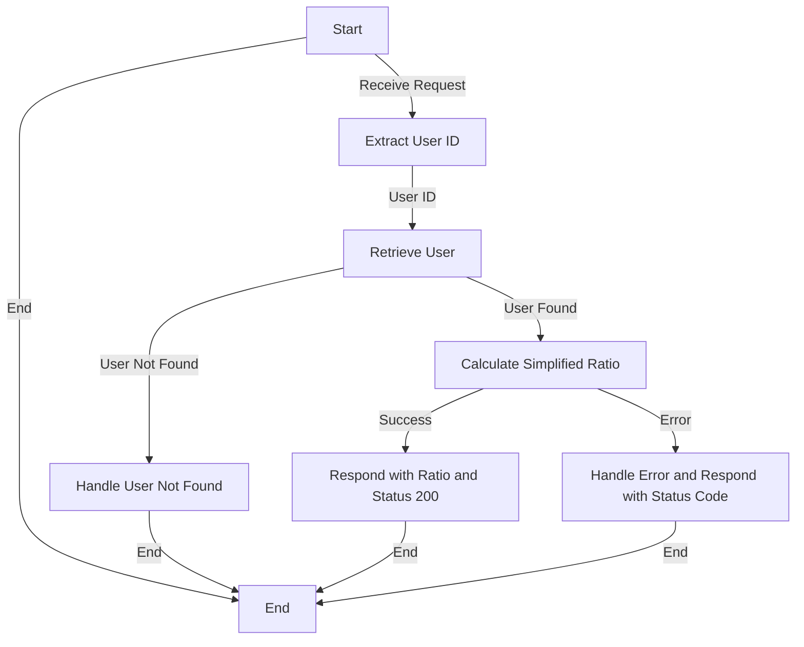

# Get Follower to Following Count Ratio

## About

- The `getFollowerToFollowingCountAnalysis` function serves as a vital component in the server application, analyzing the follower-to-following ratio for a specified user. Extracting the user ID from incoming requests, the function retrieves user information and calculates the simplified ratio by finding the greatest common divisor. If successful, it responds with a JSON object containing the Follower-to-Following Ratio and a 200 status code. In cases of errors, such as the user not existing or issues during the analysis, it gracefully handles errors and responds with appropriate status codes and error details in JSON format. This function provides valuable insights into the user's engagement dynamics on the platform.

## Flow



## Endpoint

```javascript title="Routes/Analysis/profileAnalysis.router.js"
ProfileAnalysisRouter.get(
  "/user/profileAnalysis/followerToFollowingRatio",
  getFollowerToFollowingCountAnalysis
);
```
