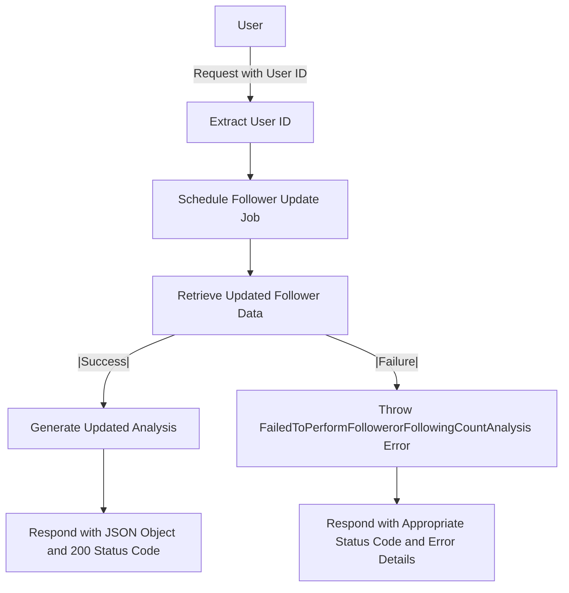
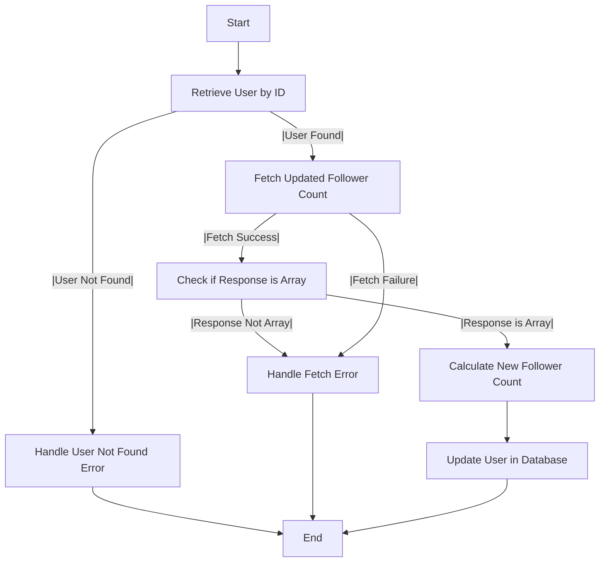

# Get Follower Count Analysis

## About

- The `getFollowerCountAnalysis` function is a crucial endpoint handler in a server application, analyzing and updating follower counts for a specified user. It extracts the user ID from incoming requests, schedules periodic updates using `scheduleFollowerUpdateJob`, and retrieves the latest follower data asynchronously with `getUpdatedFollower`. Successful responses yield a JSON object with the updated analysis and a 200 status code. In case of errors, it throws a custom error class, `FailedToPerformFollowerorFollowingCountAnalysis`, and responds with the appropriate status code and error details in JSON format. This robust error-handling mechanism ensures informative responses for successful analyses and error scenarios, enhancing the reliability of the follower count functionality.

## Flow



## Cron Job

- As the user's follower count undergoes regular changes, either increasing or decreasing, I've implemented a cron scheduler. This scheduler fetches the latest user data from the GitHub REST API service and ensures that the database is updated accordingly.

## Cron Follower Scheduler Flow



:::info

- For more about cron schedulers , refer to to the following doc about [Schedulers](/docs/Scheduler/Scheduler.md).

:::

## Endpoint

```javascript title="Routes/Analysis/profileAnalysis.router.js"
ProfileAnalysisRouter.get(
  "/user/profileAnalysis/followerAnalysis",
  getFollowerCountAnalysis
);
```
