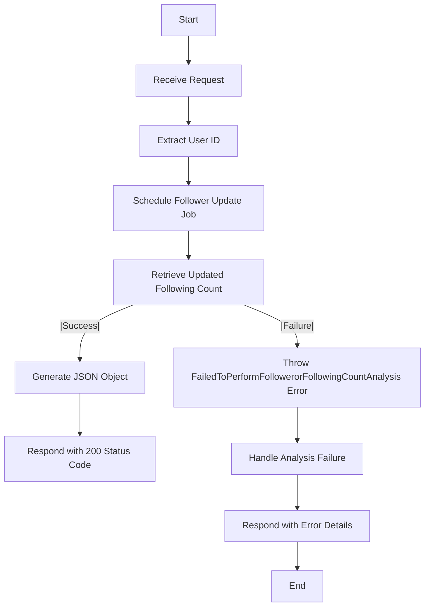
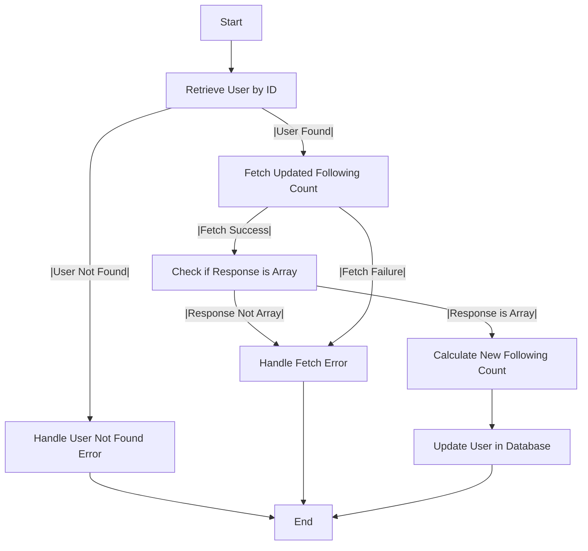

# Get Following Count Analysis

## About

- The `getFollowingCountAnalysis` function plays a pivotal role in the server application by managing requests for the analysis of following counts for a designated user. This asynchronous function extracts the user ID from incoming requests, schedules periodic follower updates with `scheduleFollowerUpdateJob`, and retrieves the updated following count using `getUpdatedFollowing`. Upon success, it responds with a JSON object containing the following count and a 200 status code. In the event of analysis failure, it gracefully handles errors, throwing a custom error, `FailedToPerformFollowerorFollowingCountAnalysis`, with pertinent details. This meticulous error handling ensures informative responses, enhancing the reliability of the server's following count analysis functionality.

## Flow



## Cron Job

- As the user's following count undergoes regular changes, either increasing or decreasing, I've implemented a cron scheduler. This scheduler fetches the latest user data from the GitHub REST API service and ensures that the database is updated accordingly.

## Cron Following Scheduler Flow



:::info

- For more about cron schedulers , refer to to the following doc about [Schedulers](/docs/Scheduler/Scheduler.md).

:::

## Endpoint

```javascript title="Routes/Analysis/profileAnalysis.router.js"
ProfileAnalysisRouter.get(
  "/user/profileAnalysis/followingAnalysis",
  getFollowingCountAnalysis
);
```
