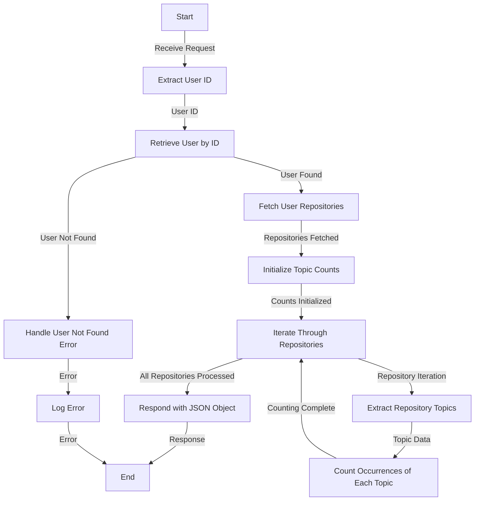

# Get Most Used Topics Analysis

## About

- The `getMostUsedTopicAnalysis` function is a server-side endpoint designed to analyze and quantify the most frequently used topics across a user's repositories. Upon receiving a request, the function extracts the user ID, retrieves the user's information, and fetches details about the user's repositories. It then iterates through each repository, counting the occurrences of each topic within the repository's topics. The result is a JSON object containing the counts of each topic, reflecting the most used topics across all repositories. In the event of any errors during this process, the function logs the error for debugging purposes and responds with a 500 status code, indicating an internal server error. This function provides valuable insights into the thematic landscape of a user's repositories, aiding in understanding their primary areas of focus and expertise.

## Flow



## Endpoint

```javascript title="Routes/Analysis/profileAnalysis.router.js"
ProfileAnalysisRouter.get(
  "/user/profileAnalysis/totalTopicsCounts",
  getMostUsedTopicAnalysis
);
```
