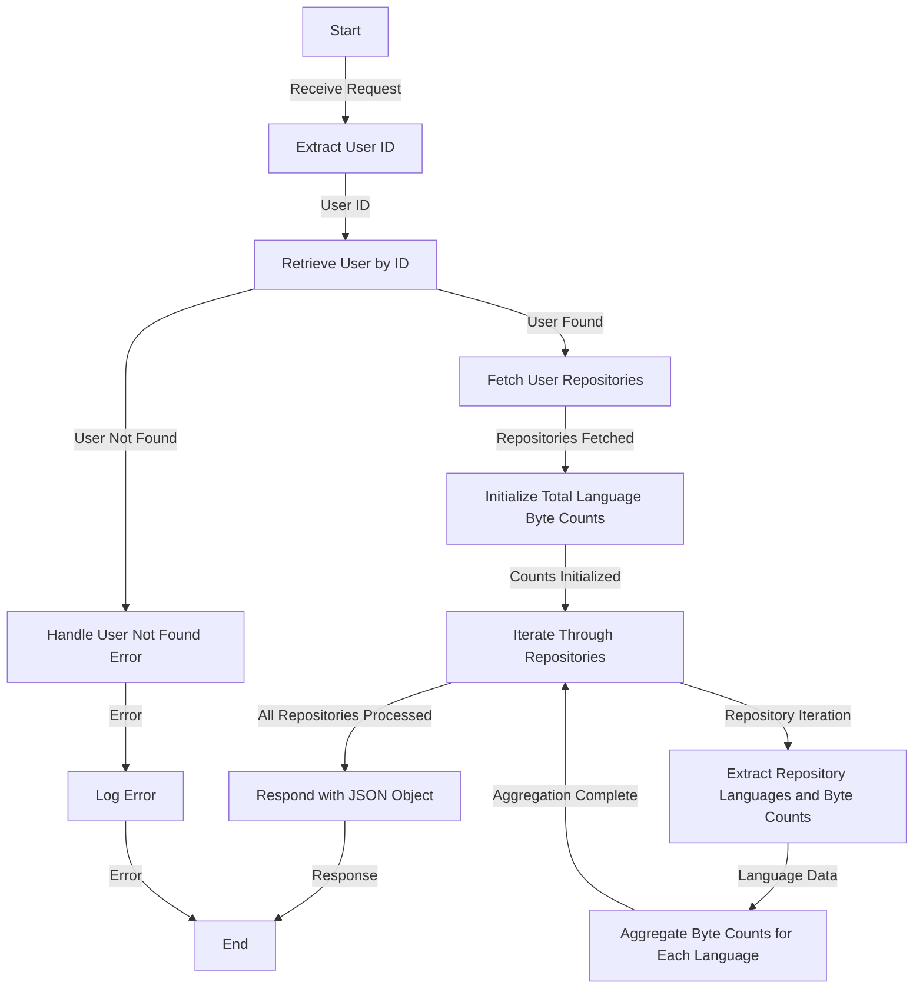

# Get Languages Used Analysis

## About

- The `getLanguagesUsedAnalysis` function is a server-side endpoint designed to analyze the distribution of programming languages used by a specific user across their repositories. Upon receiving a request, the function extracts the user ID, retrieves the user's information, and subsequently fetches details about the user's repositories. It then iterates through each repository, aggregating the byte counts for each programming language used in the repositories. The result is a JSON object containing the total byte counts for each programming language. In the event of any errors during this process, the function logs the error for debugging purposes. This function provides valuable insights into the programming language landscape of a user's repositories, aiding in the analysis of their coding preferences and practices.

## Flow



## Endpoint

```javascript title="Routes/Analysis/profileAnalysis.router.js"
ProfileAnalysisRouter.get(
  "/user/profileAnalysis/tsotalLanguageCountsAnalysi",
  getLanguagesUsedAnalysis
);
```
