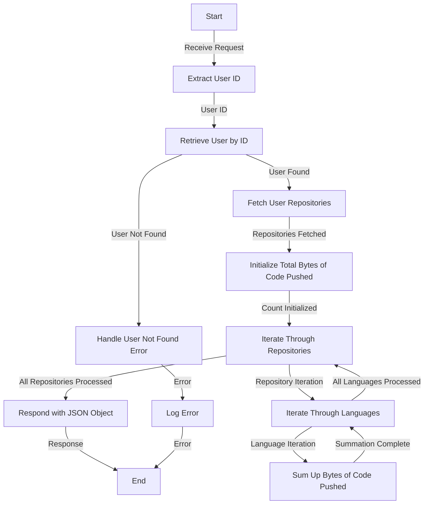

# Get Number Of Lines Of Code Pushed Analysis

## About

- The `getNumberOfLinesOfCodePushedAnalysis` function is a server-side endpoint that calculates and provides valuable insights into the total number of lines of code pushed by a specific user since joining Git. The process involves extracting the user ID, retrieving user information, and fetching details about the user's repositories. By summing up the bytes of code pushed for each programming language across all repositories, the function returns a JSON object with the total count of bytes of code pushed. It incorporates robust error handling, throwing custom error classes for scenarios like a user not existing or a document retrieval failure, and responds with appropriate status codes and error details in JSON format. This functionality enhances the understanding of a user's coding activity and contribution over their Git journey.

## Flow



## Endpoint

```javascript title="Routes/Analysis/profileAnalysis.router.js"
ProfileAnalysisRouter.get(
  "/user/profileAnalysis/totalLinesOfCodePushed",
  getNumberOfLinesOfCodePushedAnalysis
);
```
