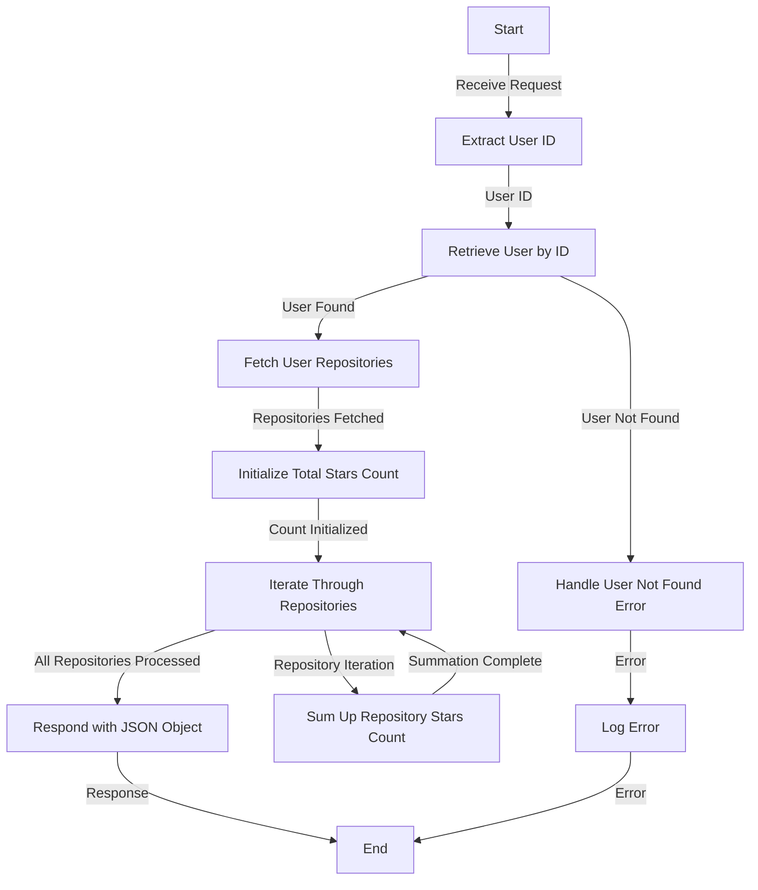

# Get Profile Stars Analysis

## About

- The `getTotalStarsForProfileAnalysis` function is a server-side endpoint that analyzes and provides insights into the total number of stars received by a specific user across all their repositories. Upon receiving a request, the function extracts the user ID, retrieves user information from the database, and fetches details about the user's repositories. It ensures the existence of both the user and the repository document, throwing custom error classes (`UserNotFoundError` and `FailedToFetchDocumentFromDatabase`) and responding with appropriate status codes and error details in case of any issues.

- The core logic involves iterating through each repository and summing up the stars count for each repository. The result is a JSON object containing the total count of stars received by the user. In case of errors, such as the user not existing or the document retrieval failure, the function gracefully handles errors and responds with the relevant status codes and error details in JSON format. This functionality offers valuable insights into the overall popularity and appreciation of a user's repositories in the GitHub community.

## Flow



## Endpoint

```javascript title="Routes/Analysis/profileAnalysis.router.js"
ProfileAnalysisRouter.get(
  "/user/profileAnalysis/totalStarsCounts",
  getTotalStarsForProfileAnalysis
);
```
