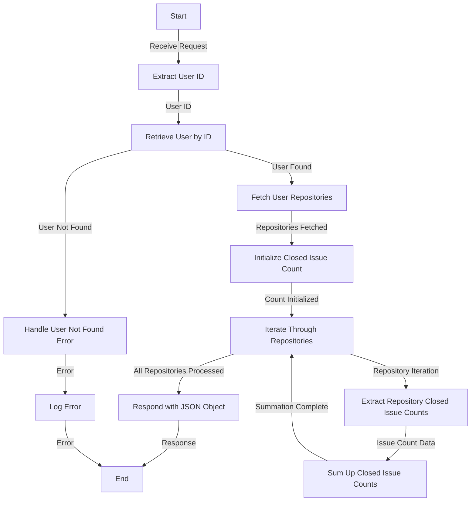

# Get Total Closed Issue Analysis

## About

- The `getTotalClosedIssueAnalysis` function serves as a server-side endpoint designed to analyze and provide the total count of closed issues across all repositories associated with a specific user. Upon receiving a request, the function extracts the user ID, retrieves the user's information, and subsequently fetches details about the user's repositories. It then iterates through each repository, summing up the counts of closed issues. The result is a JSON object containing the total count of closed issues. In the event of any errors during this process, the function logs the error for debugging purposes. This function offers valuable insights into a user's overall activity in managing and closing issues across multiple repositories.

## Flow



## Endpoint

```javascript title="Routes/Analysis/profileAnalysis.router.js"
ProfileAnalysisRouter.get(
  "/user/profileAnalysis/totalClosedIssuesCounts",
  getTotalClosedIssueAnalysis
);
```
