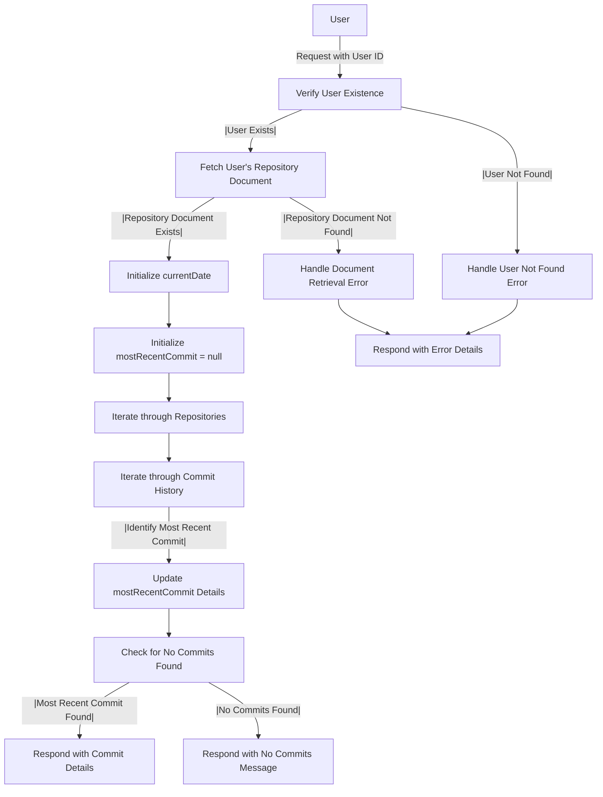

# Get Most Recent Commits Analysis

## About

- The `getMostRecentRepositoryCommitAnalysis` function is a server-side endpoint designed to provide insights into the most recent commit made by a user across all their repositories. Upon receiving a request, the function extracts the user ID, retrieves the user's information, and fetches details about the user's repositories. It then iterates through each repository and its commit history, calculating the age of each commit in days relative to the current date. The function identifies the most recent commit based on the lowest age in days, capturing details such as the commit date, repository name, and commit data. If a most recent commit is found, it responds with a JSON object containing the details; otherwise, it returns a message indicating that no commits were found. In case of errors, such as the user not existing or issues during the data retrieval process, the function handles errors gracefully and responds with appropriate status codes and error details in JSON format. This functionality enhances the understanding of a user's recent commit activity across their repositories.

## Flow



## Endpoint

```javascript title="Routes/Analysis/profileAnalysis.router.js"
ProfileAnalysisRouter.get(
  "/user/profileAnalysis/getRecentCommitAnalysis",
  getMostRecentRepositoryCommitAnalysis
);
```
