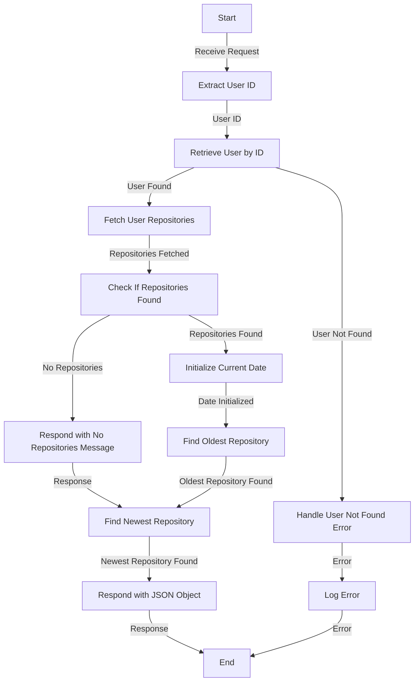

# Get Oldest and Newest User Repository Analysis

## About

- The `getNewestAndOldestRepoAnalysis` function is a server-side endpoint designed to provide insights into a user's GitHub repositories by identifying the newest and oldest repositories based on their creation dates. Upon receiving a request, the function extracts the user ID, retrieves user information from the database, and fetches details about the user's repositories. It incorporates robust error handling, throwing custom error classes (`UserNotFoundError` and `FailedToFetchDocumentFromDatabase`) and responding with appropriate status codes and error details in JSON format in case of any issues.

- The core logic involves calculating the age of each repository in days by comparing its creation date with the current date. Using the `reduce` function, it identifies the repository with the maximum age as the oldest and the repository with the minimum age as the newest. The function then responds with a JSON object containing information about both the oldest and newest repositories.

- In the event of errors, such as the user not existing or a document retrieval failure, the function gracefully handles errors and responds with the relevant status codes and error details. This functionality provides valuable insights into the historical timeline of a user's GitHub repositories, allowing users and developers to understand the evolution and duration of their codebase.

## Flow



## Endpoint

```javascript title="Routes/Analysis/profileAnalysis.router.js"
ProfileAnalysisRouter.get(
  "/user/profileAnalysis/oldestNewestRepo",
  getNewestAndOldestRepoAnalysis
);
```
