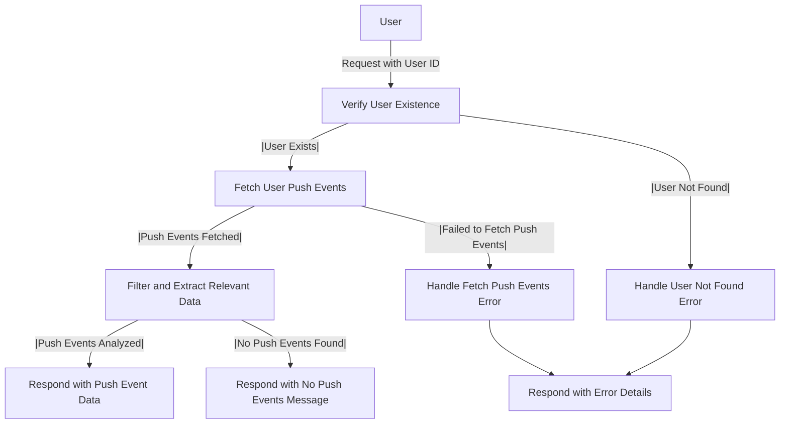

# Get Push Event Analysis

## About

- The `getUserPushEventsAnalysis` function is a server-side endpoint that facilitates the analysis of a user's push events on GitHub. It begins by verifying the existence of the user in the database, and if the user is not found, it throws a custom error, UserNotFoundError. Subsequently, the function fetches the user's push events using getUserActionsEvents and filters them to extract relevant information, such as the event type, date, and repository name. If successful, the function responds with a JSON array containing details of the user's push events. In case of errors, it handles specific scenarios, throwing a FailedToGetPushEventDataAnalysis error when unable to retrieve or analyze the push events. The function ensures informative responses and contributes to understanding a user's activity and contributions through push events on GitHub.

## Flow



## Endpoint

```javascript title="Routes/Analysis/profileAnalysis.router.js"
ProfileAnalysisRouter.get(
  "/user/profileAnalysis/getUserPushEventsAnalysis",
  getUserPushEventsAnalysis
);
```
