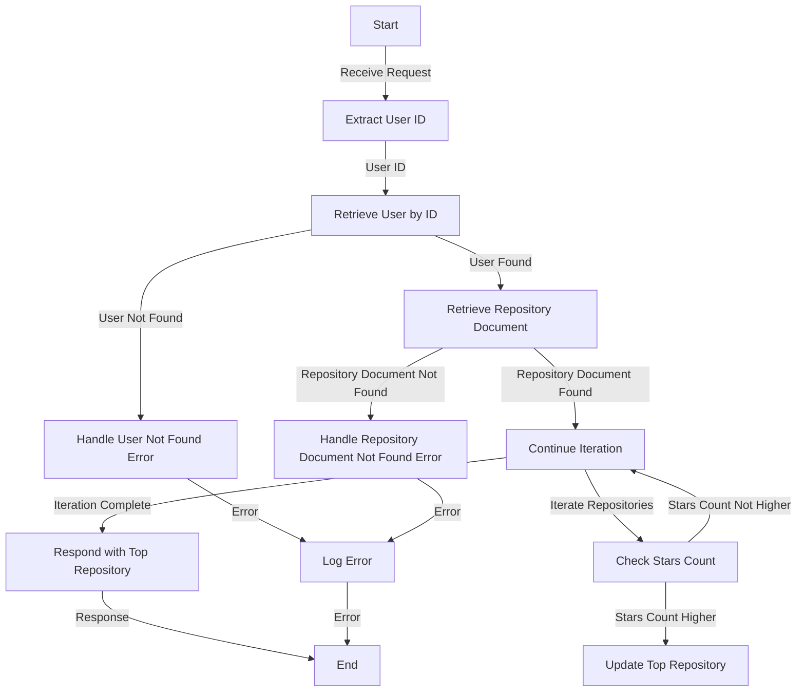

# Get User Top Repository

## About

- The `getTopRepositoryAnalysis` function is a server-side endpoint designed to provide analysis on the user's top repository based on the highest number of stars. Upon receiving a request, the function extracts the user ID, retrieves user information from the database, and checks if the user exists. If the user exists, it further fetches the user's repository document and iterates through the repositories to identify the top repository based on the highest number of stars. The relevant details of the top repository, including its name, stars count, programming language, and date of creation, are then compiled into a JSON object.

- The function incorporates robust error handling by throwing a custom error class (`UserNotFoundError`) in case the user is not found in the database. It responds with the appropriate status codes and error details in JSON format for both successful and error scenarios.

- This functionality provides valuable insights into the user's most popular repository, showcasing key metrics such as stars count, programming language, and date of creation.

## Flow



## Endpoint

```javascript title="Routes/Analysis/profileAnalysis.router.js"
ProfileAnalysisRouter.get(
  "/user/profileAnalysis/getTopRepoAnalysis",
  getTopRepositoryAnalysis
);
```
