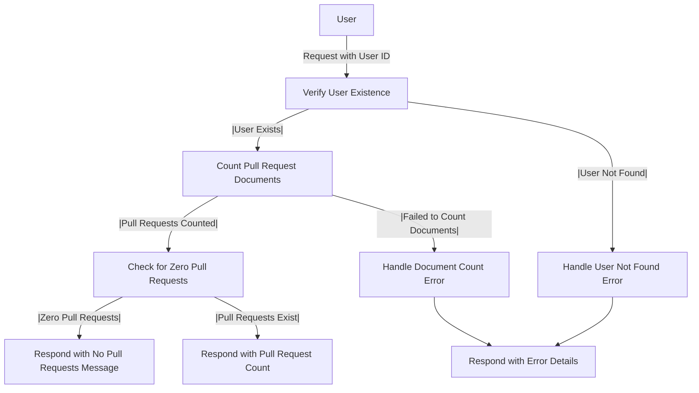

# Get Total Pull Request Analysis

## About

- The `getTotalPullRequestCountAnalysis` function is a server-side endpoint that provides an analysis of the total count of pull requests created by a specific user across all repositories. The process involves verifying the existence of the user in the database, counting the documents representing pull requests, and responding with the count. If the user is not found, a custom error UserNotFoundError is thrown; if there is an issue fetching or counting documents, a FailedToPerformCountOfDocuments error is thrown. The function handles different scenarios, such as when there are no pull requests created by the user, providing a relevant message. Overall, it contributes valuable insights into a user's engagement in the collaborative development process on Github.

## Flow



## Endpoint

```javascript title="Routes/Analysis/profileAnalysis.router.js"
ProfileAnalysisRouter.get(
  "/user/profileAnalysis/getPullRequestAnalysis",
  getTotalPullRequestCountAnalysis
);
```
