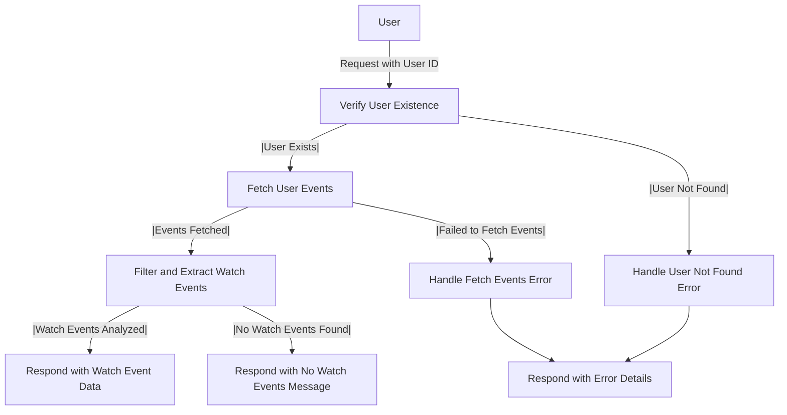

# Get Watch Event Analysis

## About

- The `getUserWatchEventAnalysis` function is a server-side endpoint designed to analyze and provide insights into a user's watch events on GitHub. The process begins by verifying the existence of the user in the database. If the user is not found, the function throws a custom error, `UserNotFoundError`. Following user verification, the function fetches the user's events, specifically focusing on watch events, using the getUserActionsEvents function. If the events are successfully fetched, the function filters and extracts relevant data, such as the event type, date, and repository name, and responds with a JSON array containing details of the user's watch events. In case of errors, the function handles specific scenarios, throwing a `FailedToGetPushEventDataAnalysis` error when unable to retrieve or analyze the watch events. This function contributes to understanding a user's interest and activity related to repositories they are watching on GitHub.

## Flow



## Endpoint

```javascript title="Routes/Analysis/profileAnalysis.router.js"
ProfileAnalysisRouter.get(
  "/user/profileAnalysis/getUserWatchEventsAnalysis",
  getUserWatchEventAnalysis
);
```
