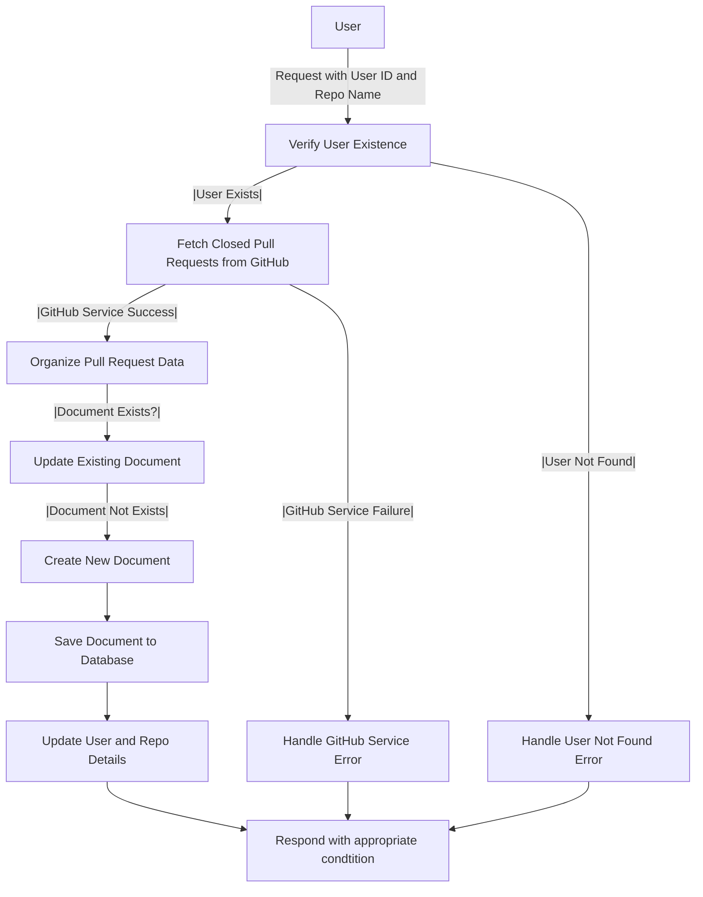

# Get User Pull Requests

## About

- The `getRepositoryClosedPullRequest` function, an Express.js route handler, retrieves `closed pull request` details for a user's GitHub repository. It checks user existence, `fetches closed pull requests` using GitHub service, and handles scenarios like `no user, GitHub service failure, or absence of closed pull requests`. The function `organizes and prepares structured data for each closed pull request`, updating or creating pull request documents in the database. User and repository details are also updated accordingly. `Error handling` ensures appropriate responses for various scenarios, ensuring a reliable interaction with GitHub and the database.

## Flow



## Endpoint

```javascript title="Routes/Repository/repos.router.js"
ReposRouter.get(
  "/user/repos/repo/getPullRequest",
  getRepositoryClosedPullRequest
);
```
