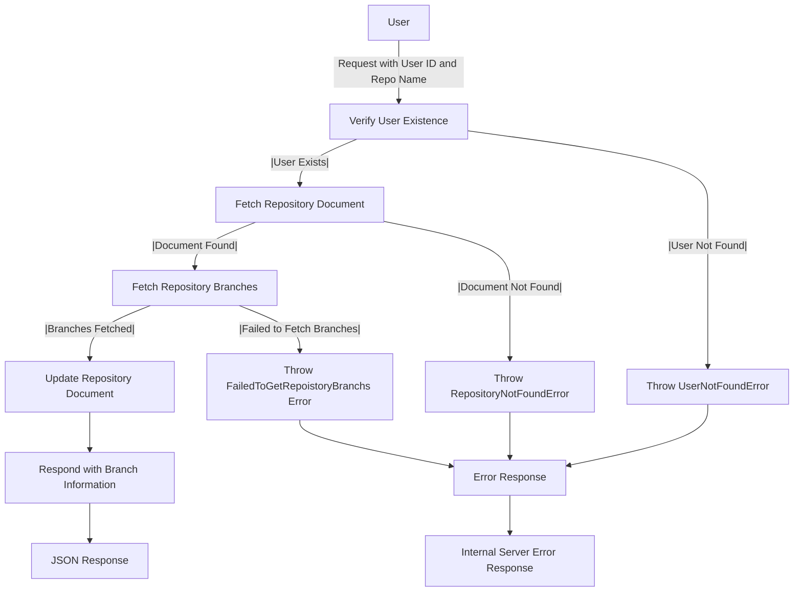

# Get Repository Branches

## About

- The `getRepositoryBranchList` function, an Express.js route handler, fetches and communicates a GitHub repository's branch list for a specified user. It verifies the user's existence, throwing a `UserNotFoundError` if not found, and fetches the repository document. Utilizing the `getRepositoryBranches` function, it retrieves the branch list, handling a `FailedToGetRepoistoryBranchs` error if unsuccessful. The function then updates the repository document with branch details and responds with a JSON object containing the branch information. Robust error handling caters to user absence or branch retrieval failure, providing specific error responses for each case, ensuring a smooth user experience.

## Flow



## Endpoint

```javascript title="Route/Repoistory/repos.routes.js"
ReposRouter.get("/user/repos/repo/getBranches", getRepositoryBranchList);
```
