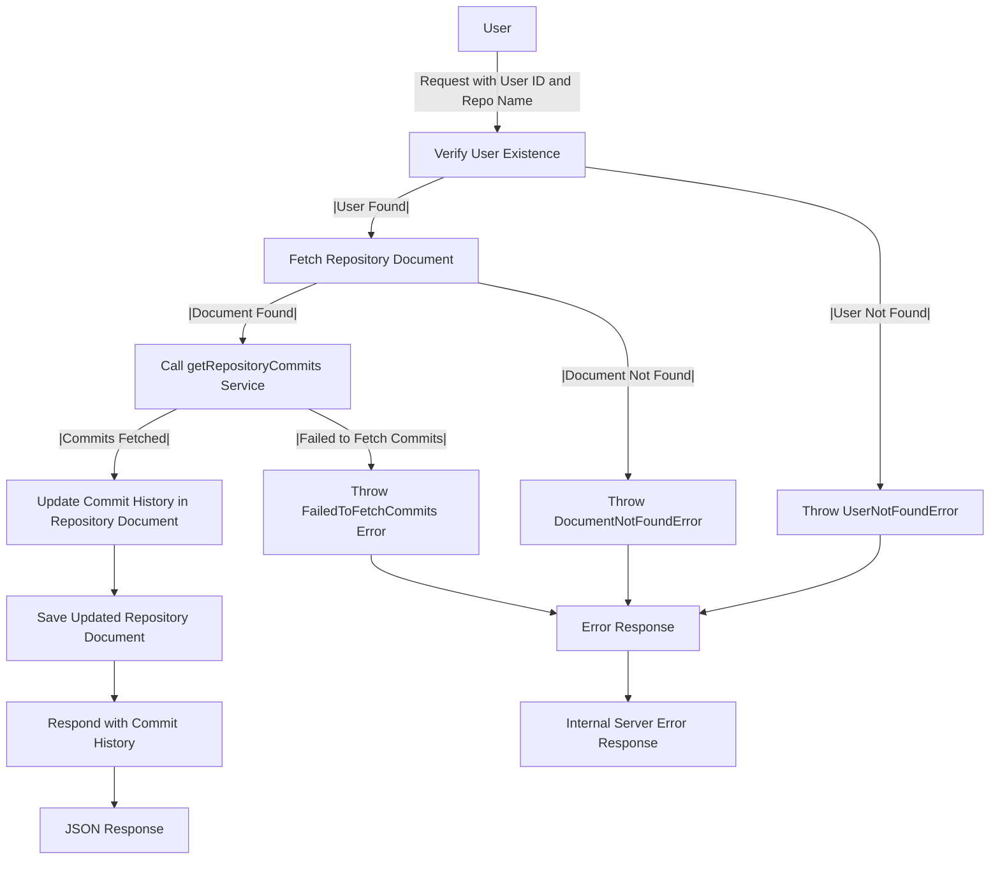

# Get Repository Commits

## About

- The `getRepositoryCommits` function, serving as an Express.js route handler, retrieves and communicates the commit history for a specific GitHub repository associated with a user. The function begins by verifying the user's existence, throwing a `UserNotFoundError` if not found in the database. Subsequently, it fetches the repository document, handling a `FailedToFetchDocumentFromDatabase` error if the retrieval is unsuccessful. The function then calls the `getRepositoryCommits` service to obtain commit details, updating the repository document with relevant commit information. The response consists of a JSON object containing the commit history. Robust error handling encompasses scenarios like user absence or document retrieval failure, ensuring precise error responses. In case of an unexpected error, a generic server error message is provided for a seamless user experience.

## Flow



## Endpoint

```javascript title="Route/Repoistory/repos.routes.js"
ReposRouter.get("/user/repos/repo/getCommits", getRepositoryCommits);
```
