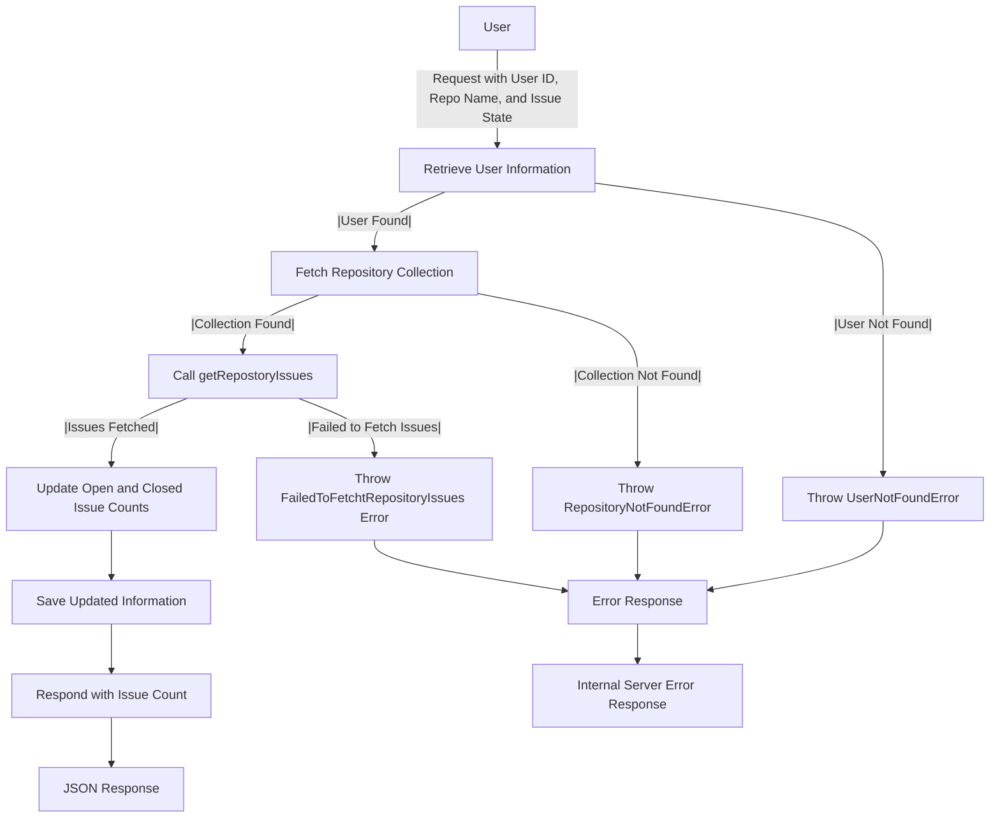

# Get Repository Issues

## About

- The `getRepositoryIssue` function, an Express.js route handler, fetches and communicates the count of issues for a specific GitHub repository associated with a user. It begins by retrieving user information, throwing a `UserNotFoundError` if the user is not found in the database. Subsequently, it fetches the repository collection, handling a `FailedToFetchtRepositoryIssues` error if the retrieval is unsuccessful. The function then calls the `getRepostoryIssues` function to fetch issues based on the provided state (open or closed), updating the counts of open and closed issues in the repository document accordingly. After saving the updated information, the function responds with the count of issues. Robust error handling includes specific custom errors for scenarios like user absence or issues retrieval failure, ensuring precise error responses. In case of an unexpected error, a generic server error message is provided for a seamless user experience.

## Flow



## Endpoint

```javascript title="Route/Repoistory/repos.routes.js"
ReposRouter.get("/user/repos/repo/getIssues", getRepositoryIssue);
```
