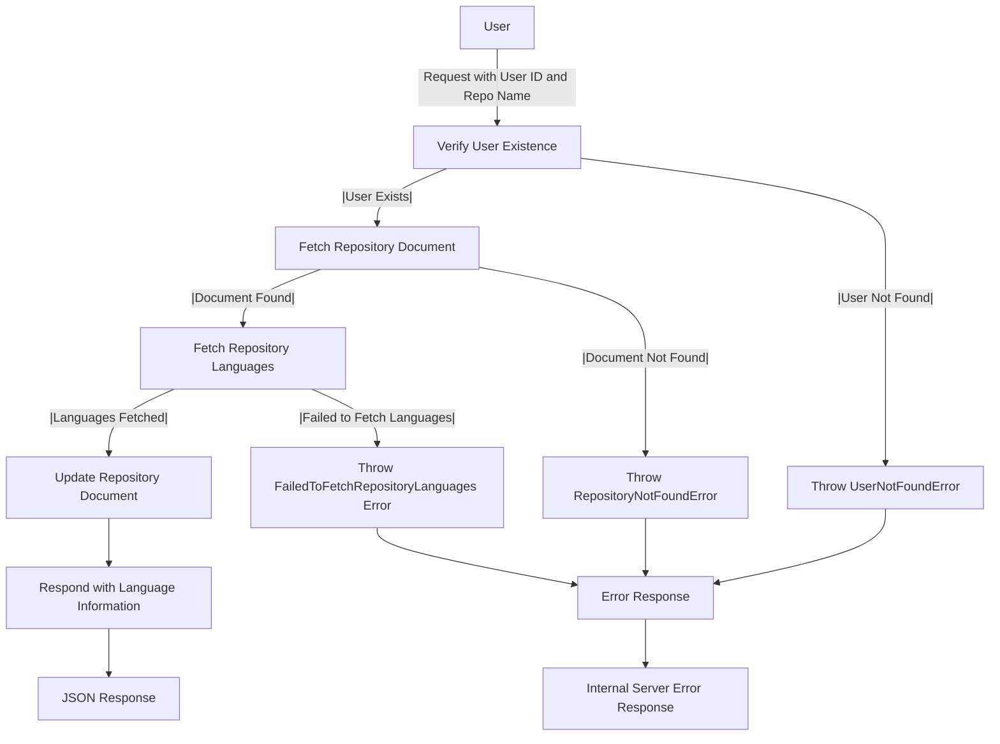

# Get Repository Language

## About

- The `getRepositoryLanguages` function, an Express.js route handler, retrieves details about programming languages and their corresponding code sizes in a user's GitHub repository. It begins by validating the user's existence and fetching the associated repository document. Utilizing `getRepositoryBuildLang` for language information, the function updates the repository document with details on each language and its code size. The response consists of a JSON object containing language information. Robust error handling includes scenarios like user not found (`UserNotFoundError`), repository absence (`RepositoryNotFoundError`), language information retrieval failure (`FailedToFetchRepositoryLanguages`), or internal server errors, providing precise error responses for each case, ensuring a seamless user experience.

## Flow



## Endpoint

```javascript title="Route/Repoistory/repos.routes.js"
ReposRouter.get("/user/repos/repo/getRepoLang", getRepositoryLanguages);
```
