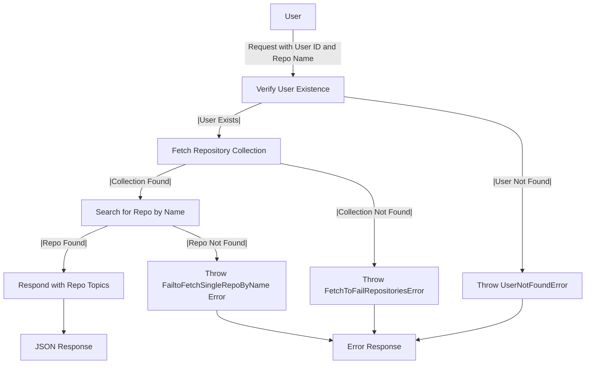

# Get Repository Topics

## About

- The `getRepositoryTopic` function, implemented as an asynchronous route handler in Express.js, serves to retrieve and communicate the topics associated with a particular GitHub repository for a given user. The function starts by verifying the user's existence in the database, throwing a `UserNotFoundError` if the user is not found. It then proceeds to fetch the user's repository collection using the GitHub repository ID, and if no collection is found, a `FetchToFailRepositoriesError` is thrown. Subsequently, the function searches for the specified repository by name within the collection, throwing a `FailtoFetchSingleRepoByName` error if the repository is not found. Upon locating the repository, the function responds with a JSON object containing the topics extracted from the repository's `repo_topics` property. The function incorporates robust error handling to address scenarios such as user not found, failure to fetch repository data, or the absence of the specified repository by name, ensuring informative responses in each case.

## Flow



## Endpoint

```javascript title="Route/Repoistory/repos.routes.js"
ReposRouter.get("/user/repos/repo/getRepoTopics", getRepositoryTopic);
```
