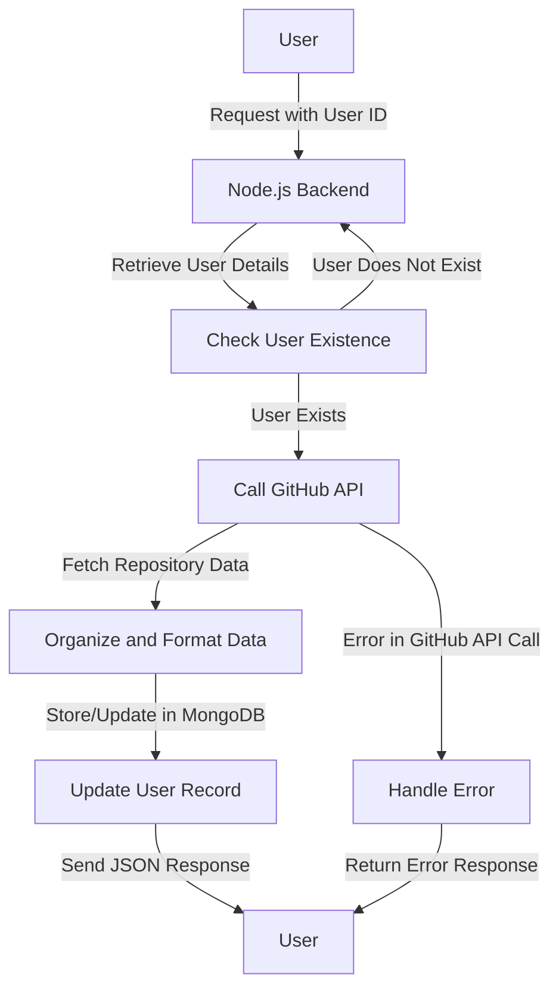

# Get User Repository

## About

- The `getUserRepository` function serves as an **Express.js route handler**, designed to fetch and store GitHub repository data for a specified user. Upon receiving a **user ID in the request**, it retrieves user details from the database. If the user exists, it calls the GitHub API to obtain information about the user's repositories. The fetched data is then **organized and formatted** before being stored or updated in the MongoDB database. The user's record is also **updated with the repository data's ID**. The function provides error handling for user not found scenarios and other internal server errors, delivering a structured JSON response containing the formatted repository data.

## Flow



## Endpoint

```javascript title="Routes/Repository/repos.router.js"
ReposRouter.get("/user/repos", getUserRepository);

where ,

getUserRepository - Name of the Controller / Route hanlder.
```
