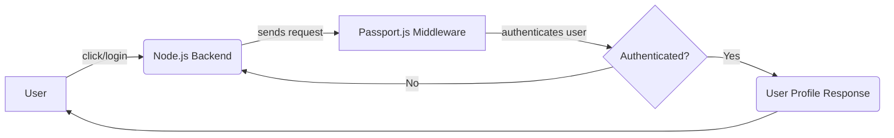

# Github Authentication

## About

- This guide details the utilization of GitHub Auth for user authentication, providing an auth token and user profile in the response.

## Authentication Flow

```mermaid
graph LR
A[User] -- click/login --> B(Node.js Backend)
B -- sends request --> C[Passport.js Middleware]
C -- authenticates user --> D{Authenticated?}
D -- Yes --> E(User Profile Response)
D -- No --> B
E --> A

```
