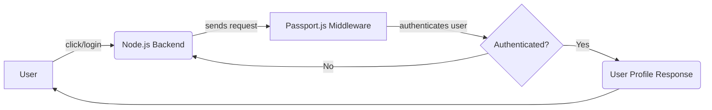

# Github Authentication

## About

- This guide details the utilization of GitHub Auth for user authentication, providing an auth token and user profile in the response.

## Authentication Flow



## Explaination

- The user (A) initiates the authentication process by clicking or logging in.
- The request goes to the Node.js backend (B).
- The Node.js backend communicates with the Passport.js middleware (C) to handle authentication.
- The Passport.js middleware authenticates the user, represented by the decision diamond (D).
- If authenticated (Yes path), it sends the user profile response (E) back to the user.
- If not authenticated (No path), it goes back to the Node.js backend to retry the authentication process.

## Auth Endpoint

- Inorder to test the api on your local , just hit the endpoint http://localhost:3004/auth/github

```javascript title="auth.router.js"
GithubRouter.get("/github", githubAuth);


where ,
githubAuth - Controller that hanldes the entire github authentication code.

```

## Controller Folder Structure

```bash title="Controller"
VersionManager/
|-- Controller/
|   | -- githubOAuth.controller.js (Passport config inorder to handle the github auth)
|   | -- githubStartegies.controller.js (Contains the entire code for handling the code response returned from the github , saving it to database and using the token)
```

:::info

Once authenticated , you would receive a **auth token** from Github. Use that **Auth Token while testimg on Postman**.

:::
